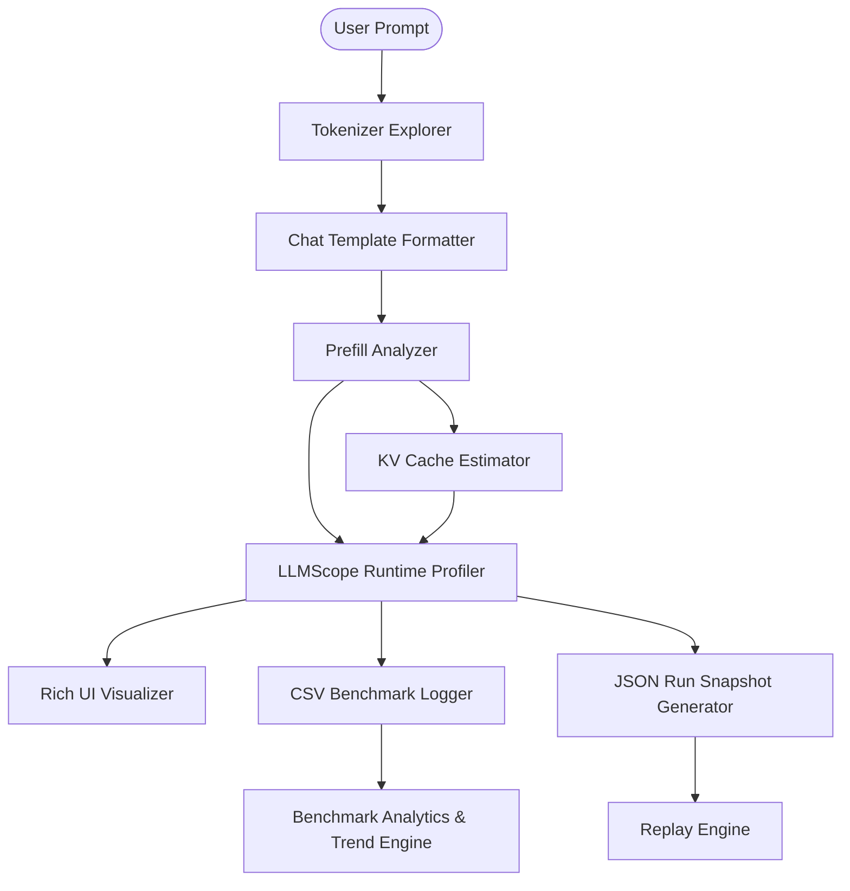
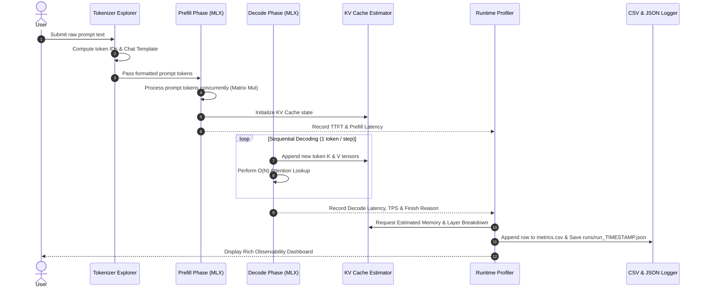

# LLMScope — Transformer Inference Observability Platform

**LLMScope** is an educational transformer inference observability platform designed to reveal what happens inside a transformer model during local inference on Apple Silicon (via Apple MLX).

---

> 💡 **Project Philosophy**
> - **LLMScope is NOT a chatbot.**
> - **LLMScope is NOT a benchmark wrapper.**
> - **LLMScope is an inference observability engine.** Every feature answers: *"What happened inside the runtime during prefill, decode, and KV cache allocation?"*

---

## 🏗 System Architecture



### 🔄 Inference Execution Flow (Sequence Diagram)



---

## 🚀 Quick Start Guide

### 1. Prerequisites
- macOS with Apple Silicon (M1/M2/M3/M4)
- Python 3.10 or higher

### 2. Installation & Setup

```bash
# Clone the repository
git clone https://github.com/soumalyaghosh/LLMScope.git
cd LLMScope

# Create and activate virtual environment
python3 -m venv venv
source venv/bin/activate

# Install dependencies
pip install -r requirements.txt
```

---

## 🎮 How to Run LLMScope

### A. Launch Interactive Profiling Session

Start the interactive CLI session. Type your prompt to run inference and observe real-time metrics.

```bash
python main.py
```

*Inside the session, type `exit` to quit.*

### B. Offline Profiling Replay Engine

Replay any recorded profiling run **without loading model weights, without running inference, and without MLX**:

```bash
# Replay the MOST RECENT run automatically:
python replay.py

# Or replay a SPECIFIC run snapshot by providing its path from the runs/ folder:
python replay.py runs/run_2026_07_28_021830.json
```

### C. Run Test Suite

Verify system integrity using the automated unit test suite:

```bash
python -m unittest discover tests
```

---

## 📁 Repository Structure

```
LLMScope/
├── main.py                 # Primary interactive CLI REPL entry point
├── replay.py               # Offline JSON run snapshot replay CLI engine
├── runtime/                # Core inference & observability modules
│   ├── model_loader.py     # MLX model loader & sampler wrapper
│   ├── tokenizer.py        # Subword tokenizer explorer & Chat Template renderer
│   ├── prefill.py          # Latency analyzer (Tokenization time, TTFT, Prefill, Decode, TPS)
│   ├── kv_cache.py         # Educational KV Cache memory estimator & layer breakdown
│   ├── visualizer.py       # Rich UI renderers (Timeline, Context Evolution, Layer-wise Cache)
│   └── benchmark.py        # Historical CSV parser & performance trend engine
├── benchmarks/             # Accumulated historical benchmark logs
│   └── metrics.csv         # CSV logging target for all runs
├── runs/                   # JSON profiling run snapshots for offline replay
│   └── run_*.json          # Auto-generated JSON run snapshot files
├── tests/                  # Automated test suite
│   ├── test_kv_cache.py    # Unit tests for KV Cache estimation math
│   ├── test_benchmark.py   # Unit tests for CSV parser & trend detection
│   └── test_replay.py      # Unit tests for offline replay engine
└── requirements.txt        # Project dependencies (mlx, mlx_lm, rich, pygments)
```

---

## ✨ Feature Highlights & Mathematical Foundations

### 1. Tokenizer Explorer & Chat Template
- Displays raw Token IDs, subword tokens, and formatted template structure (`<|begin_of_text|><|start_header_id|>user...`).

### 2. Runtime Profiler
- **Prefill Latency**: Measures Tokenization Time ($t_1 - t_0$) and Time to First Token (TTFT). $\text{Prefill Time} = \text{TTFT} - \text{Tokenization Time}$.
- **Decode Performance**: Measures decode latency, throughput ($\text{tok/s}$), and finish reason (`Stop Token`, `Maximum Token Limit Reached`, `End of Sequence`).

### 3. Educational KV Cache Estimator
MLX handles Metal GPU memory dynamically. LLMScope provides a mathematically precise theoretical estimation:

$$\text{Estimated KV Cache Memory} = 2 \times \text{Layers} \times \text{Context Length} \times \text{Hidden Size} \times \text{dtype\_bytes}$$

- **Why the factor of 2?** For every token and layer, the transformer maintains **two** distinct hidden state tensors: **Key ($K$)** for attention scoring and **Value ($V$)** for context aggregation.
- **Per-Token Growth Rate**: $\sim 128 \text{ KB / token}$ for 1B transformer parameters (16 layers, 2048 hidden dim, FP16/BF16).

### 4. Inference Execution Timeline
Visualizes pipeline stage transitions and latency distribution:
$$\text{Prompt} \longrightarrow \text{Tokenizer} \longrightarrow \text{Prefill} \longrightarrow \text{First Token} \longrightarrow \text{Decode} \longrightarrow \text{Complete}$$

### 5. Context Evolution & Layer-wise Cache
- Demonstrates how each generated token extends the sequence context window ($38 \rightarrow 39 \dots \rightarrow 550$).
- Displays conceptual per-layer memory allocation across all transformer layers.

### 6. Dynamic Inference Insights & Performance Trends
- Generates dynamic, metric-driven analysis explaining prefill compute dominance, token limit bounds, and throughput stability across historical runs.

---

## 📊 Benchmark Logging & Replay Snapshots

### CSV Metric Logging (`benchmarks/metrics.csv`)
Every run automatically appends metrics to `benchmarks/metrics.csv`:

```csv
Timestamp,Model,Prompt Tokens,Response Tokens,TTFT,Estimated Prefill,Decode Time,Generation Time,Throughput,Estimated KV Cache Memory,Finish Reason
2026-07-28T02:18:30.665374,mlx-community/Llama-3.2-1B-Instruct-4bit,41,512,0.2455,0.2453,4.0323,4.2778,126.97,69.12 MB,Maximum Token Limit Reached
```

### JSON Run Snapshots (`runs/run_*.json`)
Complete profiling sessions are archived under `runs/` for offline replay:

```json
{
  "timestamp": "2026-07-28T02:18:30.666899",
  "model": "mlx-community/Llama-3.2-1B-Instruct-4bit",
  "prompt": "perform binary search in linkedlist",
  "prompt_tokens": 41,
  "response_tokens": 512,
  "ttft": 0.2455,
  "throughput": 126.97,
  "estimated_kv_cache_mb": 69.12,
  "finish_reason": "Maximum Token Limit Reached"
}
```